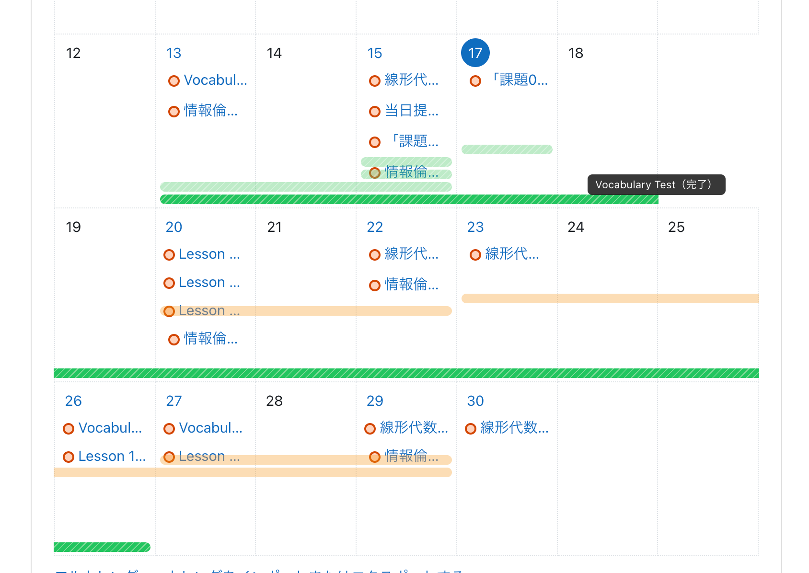

# Moodline

Moodle のカレンダーに課題のスケジュールを見やすく表示する Chrome 拡張です。

## できること

- 課題の期間をカレンダー上に表示
- 完了・未完了を色で区別
- ポップアップから色や見え方を自由に調整

## 必要な環境

- Google Chrome ブラウザ
- Moodle にログインできること

## インストール

### 1. ダウンロード
[GitHub Releases](https://github.com/your-username/moodline/releases) から最新の ZIP ファイルをダウンロードして解凍します。

### 2. Chrome に読み込む
1. Chrome で `chrome://extensions` を開く
2. 右上の「デベロッパーモード」をオンにする
3. 「パッケージ化されていない拡張機能を読み込む」をクリック
4. 解凍したフォルダを選択

これで完了です！Moodle のカレンダーページを開くと自動で動作します。

## 注意事項

### デベロッパーモードについて
デベロッパーモードを有効にすると、Chrome のセキュリティ機能の一部が制限されます。パッケージ化されていない拡張機能（このツールのような）は、より多くの機能へのアクセスが可能になるため、信頼できるソースからのみインストールしてください。

### アップデート時の拡張機能の消失
Chrome のメジャーアップデート時に、パッケージ化されていない拡張機能が自動的に無効になったり消えたりすることがあります。その場合は、再度 `chrome://extensions` から読み込み直してください。

## 使い方

### ポップアップを開く
拡張アイコンをクリックして、課題一覧を確認できます。

### 色や見た目を変更する
設定タブで以下を調整できます：
- 完了・未完了・不明の色
- バーの透明度

詳しい技術情報は [DISTRIBUTION.md](DISTRIBUTION.md) をご覧ください。

## ライセンス

MIT License - 詳細は [LICENSE](LICENSE) をご覧ください。
